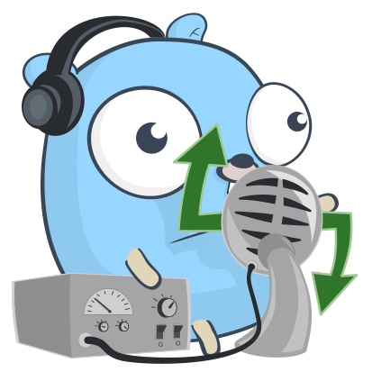

<p align="center">

</p>
<p align="center">
<a href="https://pkg.go.dev/github.com/mehditeymorian/koi/v3?tab=doc"target="_blank">
    
</a>


</p>

# tts

a lightweight package for converting text to speach with Go.

## Documentation

### Install

```bash
go get github.com/ErfanMomeniii/tts
```   

Next, include it in your application:

```bash
import "github.com/ErfanMomeniii/tts"
``` 

### Supported Languages

```bash
English US
English Uk
Arabic
```

:warning: It will update for supporting all languages in the next releases.

## Quick Start

The following example demonstrates how to play input text voice in the input language with the chosen male or female
sound.

```go
package main

import (
	"github.com/ErfanMomeniii/tts"
)

func main() {
	//generates English Us voice with man sound
	_ = tts.Speak("hello my name is Erfan", tts.EnglishUs, true)

	//generates Arabic voice with woman sound
	_ = tts.Speak("مرحبًا", tts.Arabic, false)
}

```

And if you want to save this voice you can use **SaveToFile** method as follows:

```go
package main

import (
	"fmt"
	"github.com/ErfanMomeniii/tts"
)

func main() {
	fileName, _ := tts.SaveToFile("hello my name is Erfan", tts.EnglishUs, "./example", true)
	
	fmt.Println(fileName)
}
```

## Contributing
Pull requests are welcome. For changes, please open an issue first to discuss what you would like to change.
Please make sure to update tests as appropriate.
